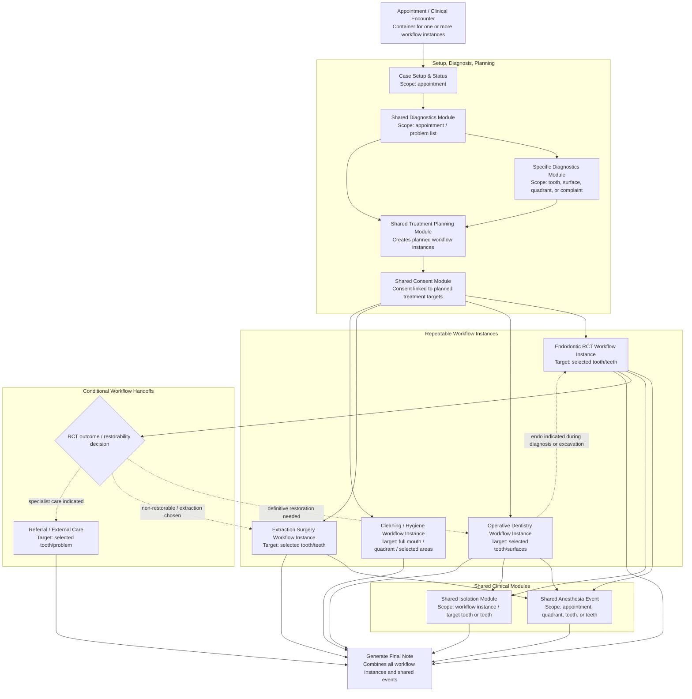
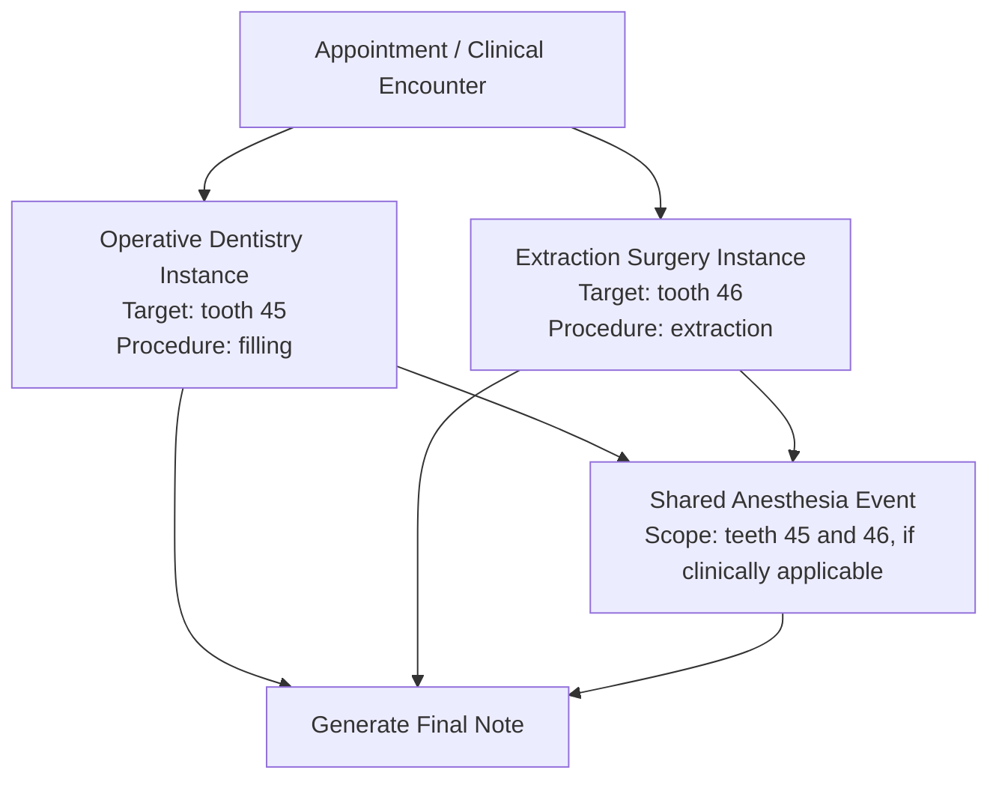

# NodeDent Workflow Map Spec

## Purpose

This spec describes how NodeDent should model clinical workflows, shared modules, and same-appointment treatment instances.

The key design decision is that an appointment is a **container**, not a single linear workflow. One appointment may contain multiple independent workflow instances, and each workflow instance must declare its own target scope.

Example:

- Operative Dentistry on tooth 45
- Extraction Surgery on tooth 46

These can happen in the same appointment, but they are unrelated unless a shared module or explicit clinical handoff links them.

## Relationship to existing architecture

This spec extends the architecture described in `docs/adr/0004-generalize-clinical-workflow-nodes.md` and should be read with `docs/specs/workspace-cross-workflow-consistency.md`.

Use this document as a product and implementation model for appointment-level workflow composition. Do not treat it as source material for new clinical recommendations. Any workflow behavior that changes clinical guidance still needs to be grounded in source material, an active spec, or an ADR.

## Core model

```text
Appointment / Clinical Encounter
  -> Case Setup & Status
  -> Diagnostics
  -> Treatment Planning
  -> Consent
  -> One or more workflow instances
  -> Shared clinical events/modules where applicable
  -> Final note generation
```

## Important vocabulary

### Appointment / Clinical Encounter

The top-level container for a visit. It may include one or more treatment workflow instances.

### Workflow type

The reusable workflow category.

Examples:

- Endodontic RCT
- Operative Dentistry
- Extraction Surgery
- Cleaning / Hygiene

### Workflow instance

A specific occurrence of a workflow during an appointment, with its own target scope.

Examples:

- Operative Dentistry instance targeting tooth 45, surfaces MOD
- Extraction Surgery instance targeting tooth 46
- Endodontic RCT instance targeting tooth 36
- Hygiene instance targeting full mouth

### Target scope

The clinical target for a workflow or shared module.

Recommended scope types:

- appointment
- full mouth
- arch
- quadrant
- tooth
- teeth
- surface
- surfaces
- problem / complaint

### Shared module

A reusable module that can be attached to one or more workflow instances when its scope explicitly includes those targets.

Examples:

- Shared Diagnostics
- Shared Treatment Planning
- Shared Consent
- Shared Anesthesia
- Shared Isolation

### Conditional handoff

A transition from one workflow to another when a clinical decision creates a new need.

Examples:

- Endodontic RCT -> Operative Dentistry when a definitive restoration is required
- Endodontic RCT -> Extraction Surgery when the tooth is non-restorable or extraction is chosen
- Endodontic RCT -> Referral / External Care when specialist management is indicated
- Operative Dentistry -> Endodontic RCT when symptoms, diagnosis, or excavation indicates pulpal treatment

Conditional handoffs are not the same as unrelated workflows occurring in the same appointment.

## Main architectural diagram



## Example: unrelated workflows in the same appointment

This example shows two independent treatment workflow instances during one appointment.



## Implementation rules for Codex

### Rule 1: Appointment is a container

An appointment may contain multiple workflow instances.

Do not assume that an appointment has only one primary workflow.

### Rule 2: Workflow instances are repeatable and scoped

Each workflow instance must have an explicit target scope.

Examples:

```json
{
  "id": "operative_45",
  "workflowType": "operative",
  "label": "Operative Dentistry",
  "target": {
    "type": "tooth",
    "teeth": ["45"],
    "surfaces": ["MOD"]
  }
}
```

```json
{
  "id": "extraction_46",
  "workflowType": "extraction",
  "label": "Extraction Surgery",
  "target": {
    "type": "tooth",
    "teeth": ["46"]
  }
}
```

### Rule 3: Same appointment does not imply same target

Do not assume that workflows in the same appointment share the same tooth or teeth.

Example:

- Operative on tooth 45
- Extraction on tooth 46

These are separate workflow instances unless explicitly linked.

### Rule 4: Shared modules require explicit scope

Shared modules may be linked to multiple workflow instances only when their scope explicitly includes those targets.

Example:

```json
{
  "id": "anesthesia_event_1",
  "moduleType": "anesthesia",
  "scope": {
    "type": "teeth",
    "teeth": ["45", "46"]
  },
  "usedBy": ["operative_45", "extraction_46"]
}
```

### Rule 5: Conditional handoffs are different from parallel workflows

A conditional handoff occurs when one workflow creates the need for another.

Examples:

- RCT discovers poor prognosis -> Extraction
- RCT completed -> Operative definitive restoration
- Operative excavation exposes pulpal involvement -> Endodontic RCT

Do not model every theoretical permutation. Only model repeated, clinically meaningful handoffs.

### Rule 6: Endodontic workflow has special completion logic

Endodontic RCT often requires either:

- definitive restoration,
- extraction,
- referral / external care,
- or documented completion with follow-up.

Therefore, Endodontic RCT should have an explicit outcome / restorability decision node.

### Rule 7: Final note generation combines instances

The final note should aggregate:

- case setup information,
- diagnostics,
- treatment planning,
- consent,
- all workflow instances,
- shared clinical modules,
- conditional handoffs,
- referrals or external care decisions.

## Suggested data shape

```json
{
  "appointmentId": "current",
  "workflowInstances": [
    {
      "id": "operative_45",
      "workflowType": "operative",
      "label": "Operative Dentistry",
      "target": {
        "type": "tooth",
        "teeth": ["45"]
      }
    },
    {
      "id": "extraction_46",
      "workflowType": "extraction",
      "label": "Extraction Surgery",
      "target": {
        "type": "tooth",
        "teeth": ["46"]
      }
    }
  ],
  "sharedEvents": [
    {
      "id": "anesthesia_event_1",
      "moduleType": "anesthesia",
      "scope": {
        "type": "teeth",
        "teeth": ["45", "46"]
      },
      "usedBy": ["operative_45", "extraction_46"]
    }
  ]
}
```

## Recommended Codex task prompt

```md
Use `docs/specs/workflow-map.md` and `docs/specs/workflow-map.mmd` as the conceptual source of truth.

Do not implement a full workflow engine yet.

First:

1. Add or update a typed workflow map model.
2. Represent appointments as containers for multiple workflow instances.
3. Require each workflow instance to have an explicit target scope.
4. Add seed workflow definitions for Endodontic RCT, Operative Dentistry, Extraction Surgery, and Cleaning / Hygiene.
5. Add shared module definitions for Diagnostics, Treatment Planning, Consent, Anesthesia, Isolation, and Final Note generation.
6. Model conditional handoffs separately from unrelated same-appointment workflow instances.
7. Add a simple developer-facing view that shows workflow instances, target scope, shared modules, and final note aggregation.

Do not assume two workflows share the same tooth merely because they occur in the same appointment.
```
